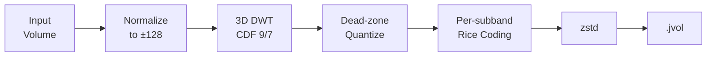
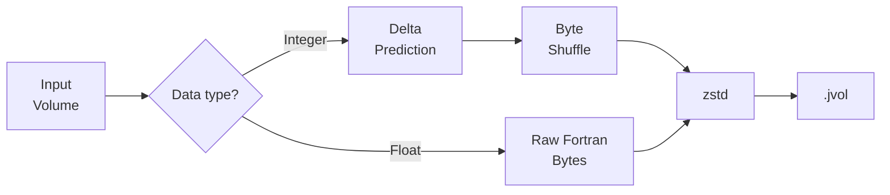
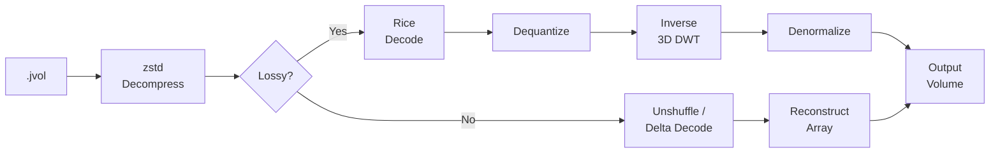

# Algorithm

JVol uses two different compression pipelines depending on the mode:
a **wavelet-based** lossy codec and a **prediction-based** lossless codec.

## Lossy mode

The lossy pipeline applies a 3D wavelet transform followed by quantization
and entropy coding:



### 1. Intensity normalization

The input array is linearly rescaled to the range `[-128, 127]`:

```
normalized = (value - min) / (max - min) × 255 - 128
```

The original `min` (intercept) and `max - min` (slope) are stored as metadata
for reversal during decoding.

### 2. 3D Discrete Wavelet Transform (DWT)

A **lifting-based CDF 9/7 wavelet transform** is applied along each axis
of the full volume (no blocking). The transform decomposes the volume into
subbands at multiple resolution levels:

- One **approximation** subband (low-frequency content)
- Seven **detail** subbands per level (capturing edges and textures along
  each combination of axes)

The number of decomposition levels is automatically determined from the
volume dimensions.

!!! info "Why wavelets instead of DCT?"
    Unlike block-based DCT (JPEG), the wavelet transform operates on the
    **entire volume** without spatial blocking. This eliminates block
    artifacts and captures correlations across the full extent of the data.

### 3. Dead-zone quantization

Each wavelet coefficient is quantized with a dead zone around zero:

```
quantized = sign(coeff) × floor(|coeff| / step)
```

The `quality` parameter (1–100) controls the step size:

- **Quality 1** → large step → aggressive quantization → tiny file
- **Quality 100** → small step → gentle quantization → larger file

The dead zone ensures that small coefficients (noise) are mapped to zero,
which is critical for compression.

### 4. Per-subband Rice coding

Each subband is independently entropy-coded using **adaptive Rice (Golomb)
coding**:

1. Coefficients are **zigzag-encoded** (signed → unsigned)
2. An **optimal Rice parameter** *k* is computed per subband based on the
   mean absolute value
3. Each value is split into a **quotient** (unary-coded) and **remainder**
   (*k* bits)

This exploits the fact that different subbands have very different
coefficient distributions — detail subbands at fine scales are mostly zeros,
while the approximation subband has larger values.

### 5. Outer compression

The encoded subbands are serialized with
[bincode](https://github.com/bincode-org/bincode) and compressed with
**zstd** (level 6).

## Lossless mode

The lossless pipeline uses dtype-aware prediction to maximize compression
without any information loss:



### Integer path (u8, u16, i16, i32)

1. **Flatten** in Fortran order (column-major) — places spatially adjacent
   voxels along the fastest-varying axis next to each other in memory
2. **Delta prediction** — each value is replaced by the difference from its
   predecessor (wrapping arithmetic). For smooth 3D data, most deltas are
   near zero
3. **Byte-shuffle** — for multi-byte types (u16, i16, i32), the byte planes
   are separated. For example, with u16 data, all low bytes come first, then
   all high bytes. After delta coding, the high-byte plane is mostly zeros
4. **zstd** compression (level 12)

!!! success "Beats gzip"
    This pipeline beats NIfTI + gzip on integer volumes. For example, the
    FPG T1 volume (`uint16`) compresses to **9.4 MB** vs gzip's **10.4 MB**.

### Float path (f32, f64)

Float data has high-entropy mantissa bits that defeat prediction-based
schemes. The float path simply stores the raw bytes in Fortran order and
relies on zstd for compression.

## Decoding

Decoding reverses each step of the corresponding pipeline:



## File format

The `.jvol` file is a **zstd-compressed bincode** archive containing:

| Field            | Type              | Description                             |
|------------------|-------------------|-----------------------------------------|
| `shape`          | `[usize; 3]`     | Original volume dimensions              |
| `num_channels`   | `usize`           | Number of 3D channels                   |
| `ijk_to_ras`     | `[[f64; 4]; 4]`  | Affine transformation matrix            |
| `dtype`          | enum              | Original data type (U8, I16, F32, etc.) |
| `wavelet`        | enum              | Wavelet type used (CDF 9/7 or LeGall)   |
| `levels`         | `usize`           | Number of DWT decomposition levels      |
| `quality`        | `u8`              | Quality parameter (0 = lossless)        |
| `channels`       | `Vec<Channel>`    | Per-channel encoded data                |

Each channel contains per-subband Rice-coded data (lossy) or a single
prediction-coded block (lossless), plus normalization metadata.
